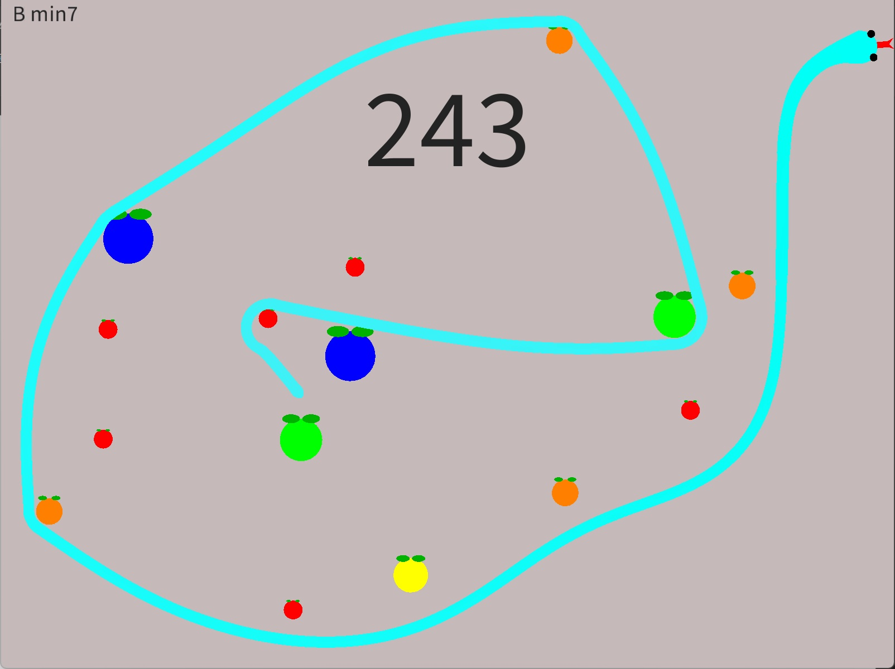

# Snake

Pequeño experimento basado en el clásico juego _Snake_, en el que tienes que comer fruta para hacerte más largo sin chocarte contigo mismo. Los principales conceptos que quería probar con este proyecto son:
- **Animación procedimental**: a diferencia del _Snake_ tradicional, este juego no está basado en una cuadrícula, sino que la serpiente se mueve y dobla de manera más parecida a como lo haría una de verdad. Esta animación, así como las colisiones de la serpiente, está calculada procedimentalmente en el runtime.
- **Música procedimental**: la música de fondo no ha sido compuesta de antemano, sino que ha sido generada procedimentalmente como se explicará más adelante.



## 🚀 Instalación y ejecución

1. Clona este repositorio:
   ```bash
   git clone https://github.com/usuario/repositorio.git
   ```
2. Abre el proyecto en [Processing IDE](https://processing.org/download/).
3. Ejecuta el archivo principal `snake.pde`.

### 📦 Alternativa: versión compilada

Descarga la última [release](https://github.com/usuario/repositorio/releases).

## 🎹 Controles

Se puede usar tanto WASD como las flechas direccionales para desplazarse en el sentido que sea

## 🛠️ Roadmap / Mejoras futuras

- Mejora de las colisiones con frutas
- Interfaz Gráfica
- Profundización en música procedimental (distintos ritmos, refinar acordes...)

## 👤 Autor

Desarrollado por [Jonás Rodríguez Unanyan](https://github.com/tuusuario).

## 📜 Licencia

Este proyecto está bajo la licencia que prefieras (ej: MIT).
